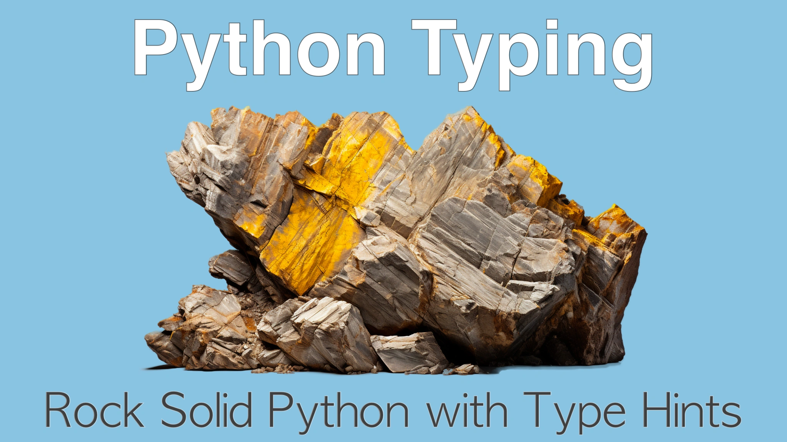

# Rock Solid Python with Type Hints Course

## Course summary

When Python was originally invented way back in 1989, it was a truly dynamic and typeless programming language. But **that all changed in Python 3.5 when type "hints" were added to the language**. Over time, amazing frameworks took that idea and ran with it. They build powerful and type safe(er) frameworks. Some of these include Pydantic, FastAPI, Beanie, SQLModel, and many many more. **In this course, you'll learn the ins-and-outs of Python typing** in the language, explore some popular frameworks using types, and get some excellent advice and guidance for using types in your applications and libraries.

## What topics are covered

In this course, you will:

* **Compare popular static languages with Python** (such as Swift, C#, TypeScript, and others)
* See a exact clone of a **dynamic Python codebase along side the typed version**
* Learn how and when to **create typed variables**
* Understand **Python's strict nullability** in its type system
* Specify **constant** (unchangeable) variables and values
* Reduce SQL injection attacks with LiteralString
* Uses **typing with Python functions** and methods
* Use **typing with classes** and class variables
* Work with multiple numerical types with **Python's numerical type ladder**
* Use **Pydantic to model and parse** complex data in a type strict manner
* **Create an API with FastAPI** that exchanges data with type integrity
* **Query databases with Pydantic** using the Beanie ODM
* **Create CLI apps using type information** to define the CLI interface
* Leverage **mypy for verifying the integrity** of your entire codebase in CI/CD
* Add runtime type safety to your application
* **Marry duck typing and static typing** with Python's new Protocol construct
* Learn **design patterns and guidance** for using types in Python code
* And lots more, see the full [course outline](https://training.talkpython.fm/courses/python-type-hint-course-with-hands-on-examples#course_outline).

## Learn more

Visit [the course page at Talk Python](https://training.talkpython.fm/courses/python-type-hint-course-with-hands-on-examples) to learn more and take the course!